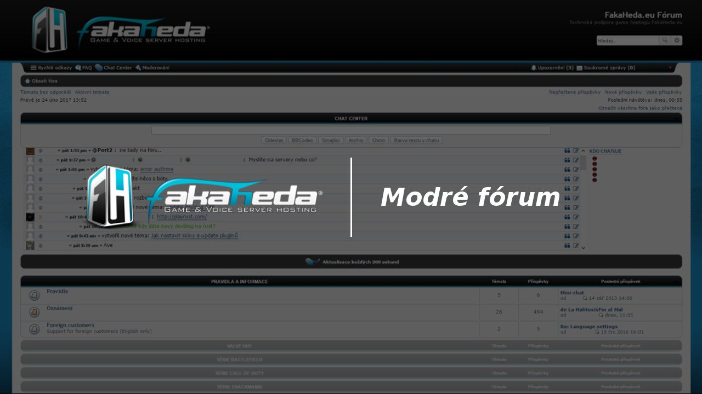
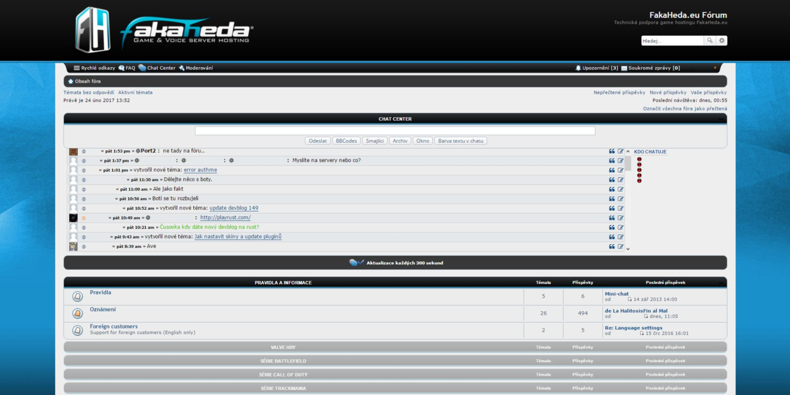

# fakaheda-blueforum

# FakaHeda.eu Fórum – Modrý styl (fakaheda-blueforum)

UserCSS v modrém stylu korespondující s hlavním webem pro fórum technické podpory [FakaHeda.eu](https://forum.fakaheda.eu) pro rozšíření prohlížeče stylující stránky jako Stylus nebo Stylish 

Temporary theme of the FakaHeda tech support Forum which is changes to look as the main website together with the Control Panel. This theme's main color is blue so that it is different from the website and corresponds with the color of the logo.

## Ukázka

## Instalace

1. Nainstalujte [Stylus for Firefox](https://addons.mozilla.org/en-US/firefox/addon/styl-us/), [Chrome](https://chrome.google.com/webstore/detail/stylus/clngdbkpkpeebahjckkjfobafhncgmne), [Opera](https://addons.opera.com/en-gb/extensions/details/stylus/) or [Cascadea for Safari](https://cascadea.app/).
2. Nainstaluje [floatplane-dark.css](https://raw.githubusercontent.com/nejento/fakaheda-blueforum/main/fakaheda-blueforum.user.css).

## Přispívání

Pokud chcete přispět do tohoto repozitáře, prosím…

1. [ Forkněte](https://github.com/nejento/fakaheda-blueforum/main//fork) nebo [ stáhněte](https://github.com/nejento/fakaheda-blueforum/main/archive/master.zip) tento repozitář.
1. 👌 Vytvořte pull request s popisem změn!

## FakaHeda.eu
Nezapomeňte se podívat na [FakaHeda.eu](https://forum.fakaheda.eu), pokud hledáte kvalitní herní hosting! 
